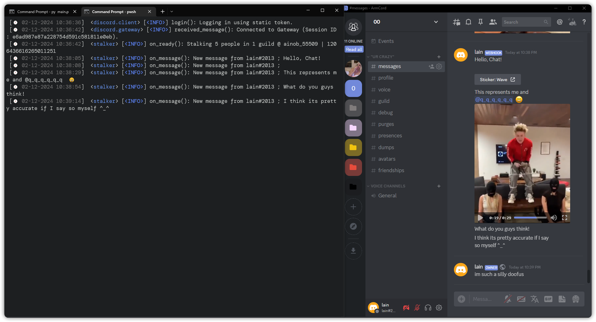

# Stalker
> [!NOTE]
> 

> [!IMPORTANT]  
> For this you need [application(Bot/Oauth2)](https://discord.com/developers/docs/resources/application#application-resource) owned webhooks because of [components](https://discord.com/developers/docs/interactions/message-components#message-components) :/

## Description
Stalker is a Discord tool used to monitor a user's activity across various guilds. It provides 'real-time' updates and notifications about the user's interactions and activities.

## Installation

1. Clone this repository to your local machine. 
```bash
git clone https://github.com/moderating/stalker
```
2. Install the required dependencies by running `pip install -r requirements.txt` in your terminal.

## Configuration

The configuration for Stalker is located in `configxd.py`. This file contains the following:

- `stalked`: A list of user IDs to monitor.
- `pathdumps`: The path where dumps will be stored.
- `token`: The user token.
- `limit`: The limit for message searching.
- `webhooks`: A dictionary of webhooks for different types of notifications.
- `message_contains`: A list of regular expressions to match in messages.
- `matches`: A dictionary of match types to enable or disable.

Update these values as needed for your use case.

## Usage

1. Set your configuration in `configxd.py`
2. Run the script by typing `python stalker.py` in your terminal.